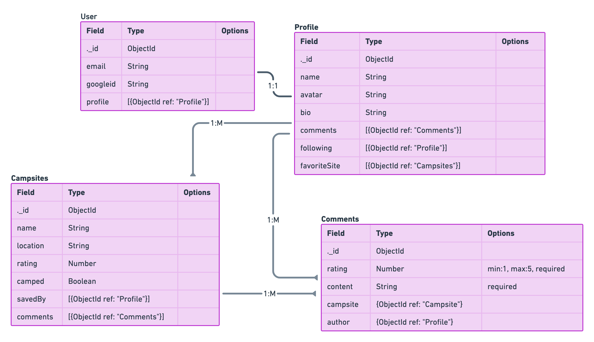
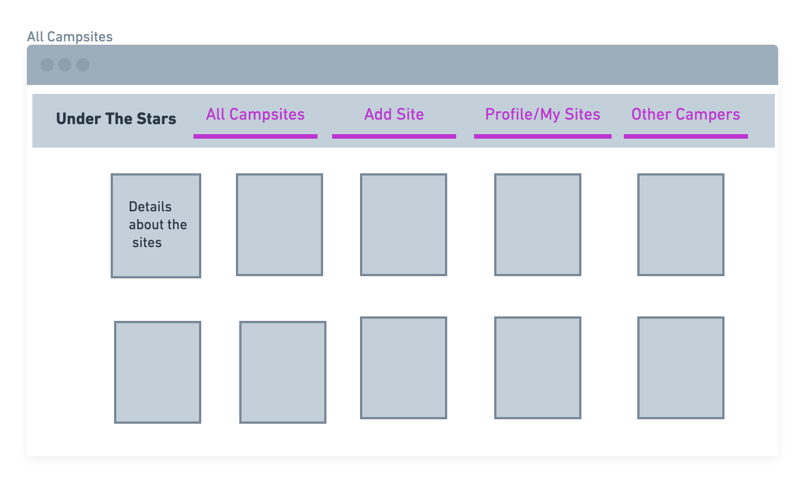

# **_⛺🌟Under the Stars🌟⛺_**
_____

## Getting Started
### **Description & Background**
Under the Stars is a camping app intended for users to be able to track their favorite campsites. It allows users to add campsites, rate other campsites, view what campsites other users have added, as well as allowing them to follow other users. 

I love camping and exploring in the mountains, its actually what my husband and I did for our honeymoon and we go every year on our anniversary. 

[Trello Board](https://trello.com/b/D6fD53dQ/under-the-stars)

[Heroku Deployed App](https://under-the-stars.herokuapp.com/)

___

## Images
ERD- initial design

Wire Frame

___

## Technologies Used

    -JavaScript, EJS

    -HTML

    -CSS
    
    -MEN Stack: MongoDB, Express, Node. 

    -Git

    -Heroku

    -Tailwinds/Daisy UI

    -Express

    -Google Oauth 2.0 

    -NPM Modules

---

## Next Steps

 Planned future enhancements that I would like to make:
  
 
- view and follow other users
- save campsites
- mobile responsive design
- light/dark mode
- alternate text for accesibility 
- Improved CSS styling using daisy and tailwinds framework
- Add animations, sounds, better styling
- Impliment API: national parks or google maps to save locations of campsites. 

